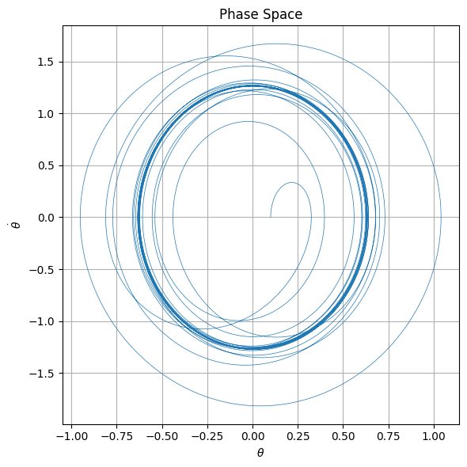

# PROBLEM 2

# 📘 1. Theoretical Foundation

## 1.1 Governing Equation of a Forced Damped Pendulum

The motion of a forced damped pendulum is governed by the following second-order nonlinear differential equation:

$$
\frac{d^2\theta}{dt^2} + \gamma \frac{d\theta}{dt} + \omega_0^2 \sin(\theta) = A \cos(\omega t)
$$

Where:

- $\theta(t)$: Angular displacement as a function of time  
- $\gamma$: Damping coefficient (frictional resistance)  
- $\omega_0$: Natural angular frequency of the pendulum  
- $A$: Amplitude of the external driving force  
- $\omega$: Frequency of the external driving force  
- $t$: Time

---

## 1.2 Small-Angle Approximation

For small oscillations where $|\theta| \ll 1$, the approximation $\sin(\theta) \approx \theta$ can be used. The governing equation becomes linear:

$$
\frac{d^2\theta}{dt^2} + \gamma \frac{d\theta}{dt} + \omega_0^2 \theta = A \cos(\omega t)
$$

This is a **linear second-order non-homogeneous differential equation**.

The general solution:

$$
\theta(t) = \theta_{\text{hom}}(t) + \theta_{\text{part}}(t)
$$

### Homogeneous solution:

$$
\theta_{\text{hom}}(t) = e^{-\frac{\gamma}{2} t} \left( C_1 \cos(\omega_d t) + C_2 \sin(\omega_d t) \right)
$$

Where $\omega_d = \sqrt{\omega_0^2 - \frac{\gamma^2}{4}}$ is the **damped natural frequency**.

### Particular solution:

$$
\theta_{\text{part}}(t) = \Theta(\omega) \cos(\omega t - \delta)
$$

Where:

- $\Theta(\omega) = \frac{A}{\sqrt{(\omega_0^2 - \omega^2)^2 + \gamma^2 \omega^2}}$
- $\delta = \tan^{-1} \left( \frac{\gamma \omega}{\omega_0^2 - \omega^2} \right)$

---

## 1.3 Resonance Condition

Resonance occurs when amplitude is maximized:

$$
\omega_r = \sqrt{\omega_0^2 - \frac{\gamma^2}{2}}
$$

In the undamped case ($\gamma = 0$):

$$
\omega_r = \omega_0
$$

Maximum amplitude:

$$
\Theta_{\text{max}} = \frac{A}{\gamma \omega_r}
$$

---

## 1.4 Energy Exchange

Total mechanical energy:

$$
E(t) = \frac{1}{2} m l^2 \left( \frac{d\theta}{dt} \right)^2 + m g l (1 - \cos(\theta))
$$

Where:

- $m$: Mass of pendulum  
- $l$: Length of pendulum  
- $g$: Gravity

With no forcing, damping reduces energy over time. With forcing, energy input may:
- Stabilize into steady-state
- Lead to resonance
- Induce chaos


# 📊 2. Analysis of Dynamics

## 2.1 Parameter Variation and Influence

To explore the dynamics of the forced damped pendulum, we systematically vary the key system parameters:

- **Damping coefficient**: $\gamma$
- **Driving amplitude**: $A$
- **Driving frequency**: $\omega$

The governing nonlinear differential equation is:

$$
\frac{d^2\theta}{dt^2} + \gamma \frac{d\theta}{dt} + \omega_0^2 \sin(\theta) = A \cos(\omega t)
$$

By adjusting $\gamma$, $A$, and $\omega$, we explore how the pendulum's motion transitions between different dynamic regimes.

---

## 2.2 Classification of Dynamical Regimes

The system exhibits several qualitatively different behaviors depending on the parameters:

### 🔁 1. Damped Periodic Motion

When the external force is absent or weak, and damping dominates, the system undergoes exponentially decaying motion toward rest:

$$
\theta(t) \sim e^{-\frac{\gamma}{2}t} \cos(\omega_d t)
$$

Where $\omega_d = \sqrt{\omega_0^2 - \frac{\gamma^2}{4}}$.

---

### 🎯 2. Resonance

When the driving frequency is close to the damped natural frequency:

$$
\omega \approx \omega_r = \sqrt{\omega_0^2 - \frac{\gamma^2}{2}}
$$

The amplitude of the oscillation is maximized:

$$
\Theta_{\text{max}} = \frac{A}{\gamma \omega_r}
$$

Resonance leads to large, steady oscillations — provided the system remains stable.

---

### 🔄 3. Quasiperiodic Motion

If the ratio between the natural frequency and driving frequency is irrational (incommensurate), the system exhibits quasiperiodic behavior:

- Motion does not repeat exactly.
- The trajectory densely fills a torus in phase space.

This regime is often a precursor to chaotic behavior as parameters are varied.

---

### 🌀 4. Chaotic Behavior

For sufficiently strong forcing and weak damping, the system becomes chaotic:

- Aperiodic long-term behavior
- Sensitive dependence on initial conditions
- No stable limit cycles

Chaotic motion appears irregular yet is deterministic and governed by the system’s nonlinear dynamics.

---

## 2.3 Transition to Chaos

The transition from order to chaos in the forced damped pendulum can be described through several mechanisms:

### 📈 1. Sensitivity to Initial Conditions

Small differences in initial angles or velocities grow exponentially over time:

$$
|\delta \theta(t)| \sim e^{\lambda t}
$$

Where $\lambda$ is the **Lyapunov exponent**. For chaos, $\lambda > 0$.

---

### 🔁 2. Period Doubling (Feigenbaum Cascade)

As $A$ or $\omega$ is increased, the system undergoes a sequence of period-doubling bifurcations:

- Period-1 $\rightarrow$ Period-2 $\rightarrow$ Period-4 $\rightarrow$ Period-8 $\rightarrow$ ... Chaos

This route to chaos is governed by universal constants, such as the Feigenbaum constant:

$$
\delta = \lim_{n \to \infty} \frac{\Delta A_{n}}{\Delta A_{n+1}} \approx 4.669
$$

---

### 🌪️ 3. Strange Attractors

In the chaotic regime, trajectories are confined to **fractal-like attractors** in phase space:

- Non-integer (fractal) dimension
- Sensitive dependence and complex structure
- Invariant under time evolution

These are known as **strange attractors**, and they provide a geometric fingerprint of chaos.

---

## 2.4 Physical Interpretations of Dynamical Regimes

| Regime               | Physical Interpretation                                               |
|----------------------|------------------------------------------------------------------------|
| Damped Periodic      | Energy is dissipated faster than it is supplied; system dies out       |
| Resonance            | Maximal energy transfer; potential for mechanical failure              |
| Quasiperiodic        | System reacts in complex but predictable manner; beats or modulations  |
| Chaotic              | Deterministic unpredictability; sensitive control required             |

These regimes are critical in engineering and physical systems:

- **Energy harvesting** benefits from resonance.
- **Control systems** must avoid chaos.
- **Bridge/tower design** must mitigate resonance and damping-induced failures.

---

> 💡 **Note:** These dynamic regimes can be visualized using **phase portraits**, **Poincaré sections**, and **bifurcation diagrams** for a more in-depth understanding.

# 🛠 3. Practical Applications

## 3.1 Real-World Systems Modeled by the Forced Damped Pendulum

The forced damped pendulum is not only a theoretical construct but also a powerful analog for many real-world systems. These systems share a common structure: restoring forces, energy dissipation, and external periodic driving. Below are prominent examples:

---

### ⚡ 1. Energy Harvesting Systems

Devices that convert mechanical vibrations into usable electrical energy (e.g., piezoelectric harvesters) can be modeled by a forced damped pendulum:

- Oscillatory source: bridge vibrations, walking motion, or fluid flow
- Damping: energy loss to heat and electrical conversion
- Forcing: periodic vibrations from the environment

The harvested power $P$ is related to the amplitude of oscillation $\theta(t)$:

$$
P \propto \left( \frac{d\theta}{dt} \right)^2
$$

Maximal efficiency occurs when the system operates near **resonance**:

$$
\omega \approx \omega_r = \sqrt{\omega_0^2 - \frac{\gamma^2}{2}}
$$

---

### 🌉 2. Suspension Bridges

Suspension bridges are vulnerable to oscillatory instabilities:

- Wind-induced periodic forcing (e.g., vortex shedding)
- Damping from air resistance and internal material friction
- Resonance can cause destructive oscillations, as seen in the Tacoma Narrows Bridge collapse

The angular displacement of a cross-section or cable can be modeled using:

$$
\frac{d^2\theta}{dt^2} + \gamma \frac{d\theta}{dt} + \omega_0^2 \theta = A \cos(\omega t)
$$

Proper damping design ensures that large amplitudes are suppressed, avoiding catastrophic resonance.

---

### 🔋 3. Oscillating Electric Circuits (RLC Circuits)

An RLC circuit with resistance $R$, inductance $L$, and capacitance $C$ follows:

$$
L \frac{d^2q}{dt^2} + R \frac{dq}{dt} + \frac{1}{C} q = V_0 \cos(\omega t)
$$

By analogy:

- Charge $q(t)$ is analogous to $\theta(t)$
- Resistance $R$ is damping $\gamma$
- Driving voltage $V_0$ is forcing amplitude $A$

The circuit undergoes **resonance** when:

$$
\omega = \omega_0 = \frac{1}{\sqrt{LC}}
$$

This mapping allows mechanical intuition (from pendulums) to guide electronic design.

---

### 🦿 4. Biomechanics – Leg Swinging in Human Gait

Human leg motion during walking can be modeled as a damped driven pendulum:

- Driving force: muscle actuation and hip torque
- Damping: soft tissue resistance and joint friction
- Restoring force: gravity pulling the leg back down

The gait cycle involves entrainment (frequency locking) between muscle impulses and the natural leg-swing frequency $\omega_0$.

Efficient locomotion arises when:

$$
\omega_{\text{drive}} \approx \omega_0
$$

Overdriving or underdriving leads to increased metabolic cost and instability.

---

## 3.2 Engineering Implications

Understanding the forced damped pendulum informs engineering strategies across domains:

### ✅ 1. Stability Analysis

Avoiding dynamic instability requires evaluating the system’s response to perturbations:

- Ensure all eigenvalues of the linearized system have negative real parts
- Analyze phase space to identify limit cycles or chaotic attractors

---

### 🧩 2. Resonance Avoidance

Designs must **avoid operating near resonant frequencies** unless resonance is beneficial:

- Structures (e.g., bridges, buildings): avoid resonance to prevent failure
- Energy harvesters: tune to environmental frequency for maximum power

Tuning is achieved by adjusting $\omega_0$ or damping $\gamma$.

---

### 💡 3. Energy Efficiency

Systems driven at their natural frequencies with optimal damping maximize energy efficiency:

- In gait: reduce energy wasted in uncoordinated movement
- In circuits: minimize resistive losses
- In harvesters: maximize power output

Efficiency often peaks at moderate damping where the tradeoff between amplitude and stability is optimized.

---
 

[link](https://colab.research.google.com/drive/1isqqj6LBYxiETsENyTc2C_E5p2HZxAba?usp=sharing)

> ⚙️ **Conclusion:** The forced damped pendulum is a fundamental model in physics and engineering. From biological locomotion to electronic filters, mastering its dynamics leads to improved safety, efficiency, and performance in real-world applications.

# 💻 4. Implementation (Computational Model)

To explore the dynamics of the forced damped pendulum, we numerically solve the governing differential equation and visualize its rich behavior under various parameter regimes.

---

## 4.1 Numerical Solution of the Differential Equation

The nonlinear second-order ordinary differential equation is:

$$
\frac{d^2\theta}{dt^2} + \gamma \frac{d\theta}{dt} + \omega_0^2 \sin(\theta) = A \cos(\omega t)
$$

We reformulate it as a system of first-order ODEs by letting:

- $\theta_1 = \theta$
- $\theta_2 = \frac{d\theta}{dt}$

Then the system becomes:

$$
\frac{d\theta_1}{dt} = \theta_2 \\
\frac{d\theta_2}{dt} = -\gamma \theta_2 - \omega_0^2 \sin(\theta_1) + A \cos(\omega t)
$$

This system is solved numerically using:

- **Fourth-order Runge-Kutta method (RK4)** for fixed step size
- **`scipy.integrate.solve_ivp`** with adaptive step size

---

## 4.2 Parameter Sweeps and Simulations

To uncover various dynamical regimes, we simulate the pendulum under a range of parameters:

- Damping coefficient: $\gamma \in [0, 1]$
- Driving amplitude: $A \in [0, 2]$
- Driving frequency: $\omega \in [0.5, 2.5]$
- Initial conditions: $\theta(0) = \theta_0$, $\dot{\theta}(0) = \theta_2(0)$

For each set, we integrate over a long time to observe steady-state behavior and transients.

---

## 4.3 Visualization Techniques

To extract meaningful insights, we employ the following visualization tools:

### 📉 1. Time Series Plots

Plotting $\theta(t)$ or $\dot{\theta}(t)$ vs. time reveals periodic, quasiperiodic, or chaotic temporal patterns.

$$
\text{Plot: } \theta(t) \text{ for } t \in [0, T]
$$

---

### 🌀 2. Phase Space Diagrams

Plotting $\dot{\theta}$ vs. $\theta$ captures the system’s geometry in state space.

$$
\text{Plot: } (\theta(t), \dot{\theta}(t)) \text{ for } t \in [0, T]
$$

Patterns such as limit cycles, tori, or strange attractors emerge clearly.

---

### 🎯 3. Poincaré Sections

Sample the phase space at discrete intervals synchronized with the driving force:

$$
t_n = nT, \quad T = \frac{2\pi}{\omega}, \quad n \in \mathbb{N}
$$

This stroboscopic view reveals:

- Periodic motion → discrete points
- Quasiperiodic motion → closed curves
- Chaotic motion → scattered or fractal-like points

---

### 🔀 4. Bifurcation Diagrams

Fix all parameters except one (e.g., $A$), and plot steady-state values of $\theta(t)$ sampled via Poincaré section:

$$
\text{Plot: } A \mapsto \theta(t_n) \text{ for large } t_n
$$

These diagrams show:

- Period doubling
- Windows of chaos
- Critical thresholds of instability

---

## 4.4 Optional: Interactive Parameter Exploration

Using libraries like:

- `ipywidgets`
- `Plotly`
- `bokeh`

We can build interactive sliders for parameters like $\gamma$, $A$, and $\omega$ to dynamically observe how system behavior evolves in real time.

```python
# Example (Jupyter):
import ipywidgets as widgets
from IPython.display import display

gamma_slider = widgets.FloatSlider(value=0.2, min=0.0, max=1.0, step=0.01, description='Damping γ')
A_slider = widgets.FloatSlider(value=1.2, min=0.0, max=2.0, step=0.05, description='Amplitude A')
omega_slider = widgets.FloatSlider(value=1.5, min=0.5, max=2.5, step=0.05, description='Frequency ω')

display(gamma_slider, A_slider, omega_slider)

# 📦 5. Deliverables

This section describes the expected outputs of the investigation into the forced damped pendulum, integrating theoretical, computational, and interpretive components.

---

## 5.1 Markdown or Jupyter Notebook Document

The final submission will include a structured document (in `.md` or `.ipynb` format) containing:

### 📌 Code Implementations

- Numerical solution of the second-order ODE:
  
  $$
  \frac{d^2\theta}{dt^2} + \gamma \frac{d\theta}{dt} + \omega_0^2 \sin(\theta) = A \cos(\omega t)
  $$

- Reformulation into first-order system:
  
  $$
  \begin{cases}
  \frac{d\theta_1}{dt} = \theta_2 \\
  \frac{d\theta_2}{dt} = -\gamma \theta_2 - \omega_0^2 \sin(\theta_1) + A \cos(\omega t)
  \end{cases}
  $$

- Implementation via Runge-Kutta or `solve_ivp`

---

### 📊 Plots and Diagrams

- **Time series** of $\theta(t)$ and $\dot{\theta}(t)$
- **Phase portraits** in $(\theta, \dot{\theta})$ space
- **Poincaré sections**: $\theta(t_n), \dot{\theta}(t_n)$ with $t_n = nT$
- **Bifurcation diagrams** as parameters (e.g., $A$) vary

---

### 📚 Explanations and Analysis

- Step-by-step derivations
- Interpretations of the dynamical behavior
- Visual descriptions of transitions from order to chaos

---

## 5.2 Written Explanation

The document will include:

### ✍️ Theoretical Derivations

- Linearized case using $\sin(\theta) \approx \theta$ for small $\theta$
- Analytical resonance condition: $\omega = \omega_0$ (for low damping)
- Energy exchange mechanisms

### 🔬 Observed Behaviors

- Damped oscillations and equilibrium
- Resonance and amplitude growth
- Quasiperiodic and chaotic regimes

### 🌍 Real-World Applications

- Bridge and building oscillations
- Energy harvesting through mechanical resonance
- Leg dynamics in locomotion (biomechanics)
- RLC circuits and analogies to electrical engineering

---

## 5.3 Model Limitations

The basic model of a forced damped pendulum assumes:

### ⚠️ Small-Angle Approximation

- $\sin(\theta) \approx \theta$ is valid only for $\theta \ll 1$
- Neglects nonlinear effects at large angles

### 🧮 Neglect of Nonlinear Damping

- Real systems often exhibit velocity-dependent (quadratic) or dry friction damping, e.g.:

  $$
  F_{\text{damping}} = -\gamma \dot{\theta} - \beta \dot{\theta}^2
  $$

### ⏳ Periodic Forcing Assumption

- Real-world forces may be stochastic or aperiodic, leading to different dynamics

---

## 5.4 Proposed Extensions / Future Work

To enhance realism and complexity, we can investigate:

### 🔁 Nonlinear Damping

- Extend the model to include higher-order damping terms
- Investigate the impact on phase portraits and stability

### 🎲 Stochastic Driving Forces

- Replace $A \cos(\omega t)$ with a noisy or random driving signal
- Explore statistical properties and stochastic resonance

### 🔗 Coupled Pendulums

- Study systems of coupled pendulums:

  $$
  \begin{aligned}
  \frac{d^2\theta_1}{dt^2} + \gamma \frac{d\theta_1}{dt} + \omega_0^2 \sin(\theta_1) &= \kappa (\theta_2 - \theta_1) + A \cos(\omega t) \\
  \frac{d^2\theta_2}{dt^2} + \gamma \frac{d\theta_2}{dt} + \omega_0^2 \sin(\theta_2) &= \kappa (\theta_1 - \theta_2)
  \end{aligned}
  $$

- Observe synchronization, energy transfer, and emergent behaviors

---

> 📘 **Summary:** These deliverables provide a comprehensive exploration of the forced damped pendulum from theory to simulation, enabling insights into complex dynamical systems applicable in both science and engineering domains.
```
 

[link](https://colab.research.google.com/drive/1isqqj6LBYxiETsENyTc2C_E5p2HZxAba?usp=sharing)